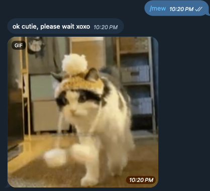
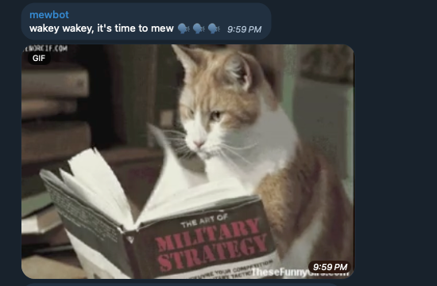

# MewBot
this sassy bot just sends me(o)w me(o)w cats at you when you tell it to.

also, random me(o)w me(o)w cats every 2 hours cuz why not.

## Demo:
/mew to send a cat gif.

reminders every 2 hours to mew.

## Stack
### Infra as Code 
AWS CDK. - ps im actually rlly loving AWS CDK. feels way smoother to use compared to terraform / terragrunt (for small projects like this).

### Serverless Lambda functions
1. MewBot - A serverless webhook that receives events from Telegram.
2. Poke - A serverless Lamda function that gets triggered by EventBridge Scheduler.

### Storage
1. AWS S3 to store Giphy API response cache.

### Optimisations:
1. Instead of always querying the Giphy.com search api, I cached the fully expanded API responses from Giphy and dumped the cache on S3. bye rate limits, helo faster queries to get cute cat gifs. This cache shouldn't get stale that fast, but if it does, we can always setup a cron job to revalidate the cache.

